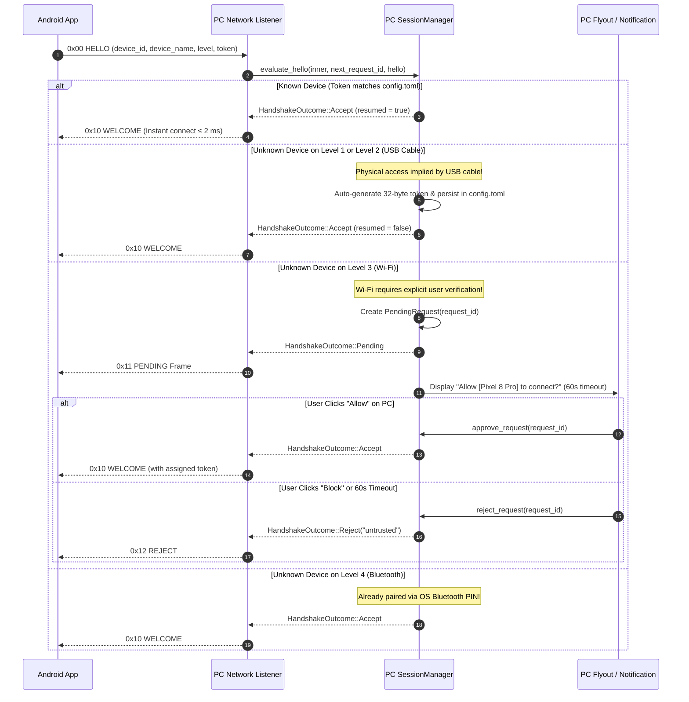

# Sessions & Trust Architecture

Security, privacy, and device pairing in Owlmic are anchored in **local cryptographic trust, transparent user authorization, and zero cloud dependency**. There are no accounts, no central servers, and no background telemetry.

---

## 1. Trust-on-First-Use (TOFU) Architecture

Owlmic uses a **Trust-on-First-Use** verification model that adjusts prompts based on the physical transport medium:



### 1.1 Policy by Transport Level (`pc/src/session/handshake.rs`)
The prompt policy balances security with effortless user convenience:
```rust
let ask_always = inner.config.ask_before_joining;
let needs_prompt = if ask_always {
    true
} else if is_known {
    false
} else {
    match hello.level {
        1 | 2 => false, // Physical USB connection implies local ownership
        3 => !inner.config.trust_wifi_automatically, // Wi-Fi requires prompt unless explicitly configured
        4 => false, // Bluetooth already authenticated via OS PIN exchange
        _ => true,
    }
};
```

---

## 2. Session Lifecycle & State Machine

```text
 ┌───────────────┐
 │     IDLE      │  Capture sensors OFF, no active sockets
 └───────┬───────┘
         │ User toggles Mic/Cam ON
         ▼
 ┌───────────────┐        Handshake Rejected (REJECT 0x12)
 │  CONNECTING   ├──────────────────────────────────────────┐
 └───────┬───────┘                                          │
         │ Handshake Approved (WELCOME 0x10)                │
         ▼                                                  │
 ┌───────────────┐                                          │
 │     LIVE      │◄──────────────────────────────────────┐  │
 └───────┬───────┘                                       │  │
         │ Socket Drop / Network Blip                    │  │ Reconnected
         ▼                                               │  │ within 30s
 ┌───────────────┐                                       │  │
 │     HELD      ├───────────────────────────────────────┘  │
 └───────┬───────┘                                          │
         │ Timeout > 30s (SESSION_HOLD_DURATION)            │
         ▼                                                  │
 ┌───────────────┐                                          │
 │    CLOSED     │◄─────────────────────────────────────────┘
 └───────────────┘
```

### 2.1 State Definitions
1. **`IDLE`**: No active streaming. Sensors and network listeners are dormant.
2. **`CONNECTING`**: TCP or RFCOMM socket dialed; exchanging `HELLO` / `WELCOME` frames.
3. **`LIVE`**: Active authenticated session transmitting media, heartbeats, and control frames.
4. **`HELD`**: Temporary disconnection grace period (`SESSION_HOLD_DURATION = 30s`).
5. **`CLOSED`**: Terminated by user, rejected, or expired past the hold window.

### 2.2 The 30-Second Session Hold Mechanism (`pc/src/session/types.rs`)
Momentary Wi-Fi disconnects or transport switches must not crash consumer applications (Zoom, Teams, OBS):
- When an active socket drops, `ActiveSession.transport_dropped_at` records the timestamp.
- During the hold window:
  - The virtual microphone emits silence to prevent audio pops.
  - The virtual camera repeats its last decoded frame.
  - The virtual audio and camera drivers remain 100% active in Windows.
- When the phone reconnects within 30 seconds, `handshake.rs` recognizes the session token and resumes the stream instantly (`resumed = true`).

---

## 3. Single Active Device Policy

To prevent multi-device conflicts and unauthorized takeovers:
- The PC daemon accepts **exactly one active phone connection at a time**.
- If a secondary phone attempts to connect while a session is active, the PC immediately responds with:
  ```json
  { "reason": "busy" }
  ```
- If the PC user explicitly chooses to disconnect the current device from the flyout UI, the PC transmits a disconnect control frame and terminates the link cleanly.

---

## 4. Privacy Invariants

1. **Default OFF State**: Microphone and camera always start in the **OFF** state. They are never automatically enabled when an app launches or a USB cable is plugged in.
2. **Foreground Indicator**: On Android, capture only runs inside a Foreground Service explicitly specifying `FOREGROUND_SERVICE_TYPE_MICROPHONE` and `FOREGROUND_SERVICE_TYPE_CAMERA`, ensuring the system green privacy dot is visible whenever hardware sensors are engaged.
3. **Zero Analytics**: No telemetry, analytics, or external network requests exist anywhere in the codebase.
