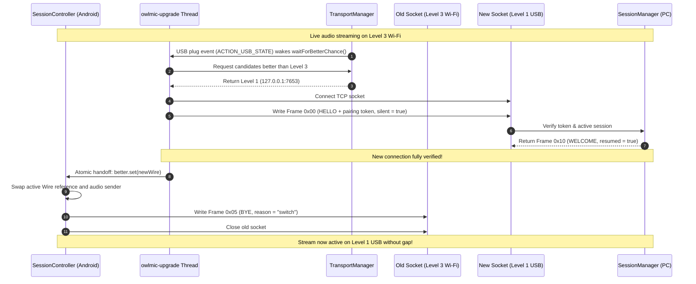

# Transports & Multi-Level Networking Architecture

Owlmic automatically negotiates the optimal physical transport between the Android client and the PC companion across **four prioritized connection levels**. It dynamically upgrades connections using a **make-before-break** strategy and fails over within 2 seconds when an active medium is interrupted.

---

## 1. Connection Level Specifications

| Priority | Level Name | Physical Substrate | Address / Port | Max Audio Capability | Max Video Capability | Latency Target |
| :---: | :--- | :--- | :--- | :--- | :--- | :---: |
| **1** | **USB Debugging** | ADB Reverse Tunnel | `127.0.0.1:7653` | Lossless PCM (48 kHz 16-bit) | MJPEG ≤1080p @ 30 fps | **≤ 20 ms** |
| **2** | **USB Tethering** | USB NIC (`rndis0`/`ncm0`) | Gateway IP `:7653` | Lossless PCM (48 kHz 16-bit) | MJPEG ≤1080p @ 30 fps | **≤ 25 ms** |
| **3** | **Wi-Fi / LAN** | 802.11 Wireless / LAN | Subnet IP `:7653` | Opus (96 kbps CBR) | MJPEG ≤720p @ 30 fps | **≤ 40 ms** |
| **4** | **Bluetooth** | RFCOMM | Owlmic service UUID | Opus (48 kbps CBR) | *None (Audio Only)* | **≤ 80 ms** |

---

## 2. Detailed Transport Mechanics

### 2.1 Level 1: USB Debugging (ADB Reverse)
- **Mechanism**: The PC companion executes a lightweight background watcher thread (`pc/src/transport/adb.rs`) that continuously inspects attached Android devices via:
  ```bash
  adb devices -l
  ```
- **Port Reversal**: When an authorized device appears, the PC runs:
  ```bash
  adb -s <SERIAL> reverse tcp:7653 tcp:7653
  ```
- **Android Connection**: Android's `TcpTransport.adb()` establishes a connection to `127.0.0.1:7653`.
- **Characteristics**: Absolute lowest latency, zero jitter, immune to wireless RF interference. Unaffected by firewall configurations or subnet isolation.

### 2.2 Level 2: USB Tethering
- **Mechanism**: When USB tethering is activated, Android exposes a network interface (typically `rndis0`, `usb0`, or `ncm0`). Android runs a local DHCP server and assigns the PC an IP address on that private subnet.
- **Discovery**: `Discovery.kt` enumerates network interfaces, filters for names matching tether prefixes (`rndis`, `usb`, `ncm`), calculates the subnet-directed broadcast address (e.g. `192.168.42.255`), and emits a UDP probe on port `7654`.
- **The Cable Hint**: If a USB connection to a PC is detected (`ACTION_USB_STATE`) for > 3.0 seconds (`CABLE_HINT_AFTER_MS = 3_000`) without Level 1 or Level 2 connecting, `TransportManager` invokes `onCableHint(true)`, causing the UI to present a non-intrusive prompt: *"Tap to turn on USB Tethering"*.

### 2.3 Level 3: Wi-Fi / Local Area Network
- **Mechanism**: Standard TCP streaming over local WLAN.
- **UDP Discovery Beacon (`PORT_UDP_BEACON = 7654`)**:
  - The PC listens on `0.0.0.0:7654` (`pc/src/transport/beacon.rs`).
  - Android broadcasts a binary probe (`Discovery.kt`):
    ```text
    "OWLMIC?1" (8 bytes) | device_id (16) | name_len (1) | device_name (UTF-8)
    ```
  - The PC responds directly to the sender's unicast address with:
    ```text
    "OWLMIC!1" (8 bytes) | pc_id (16) | tcp_port (u16 BE) | proto_ver (1) | name_len (1) | pc_name (UTF-8)
    ```
  - Packets that don't start with these magics are ignored. Builds from before the rename to Owlmic used `OWLMIC?1` and `OWLMIC!1`, so they don't find Owlmic builds this way; USB debugging and a manual address still connect them.
- **Manual Address Fallback**: In restricted corporate or university networks where UDP broadcast packets are filtered by managed switches, Owlmic provides `manualPcAddress` in Android settings to bypass discovery.
- **Wi-Fi Latency Lock (`WifiLatencyLock.kt`)**: Acquires an Android `WifiManager.WifiLock` with `WIFI_MODE_FULL_LOW_LATENCY` to instruct the wireless chipset to stay in high-power, low-latency mode.
- **Windows Firewall Detection & One-Click Elevation (`pc/src/firewall.rs`)**: On startup, when Wi-Fi or USB tethering is enabled, Owlmic queries Windows Firewall for `Owlmic TCP` (port 7653) and `Owlmic UDP Beacon` (port 7654). If either rule is missing, a non-intrusive alert banner ("Wi-Fi Blocked — Allow Access") appears in the flyout. Clicking "Allow Access" triggers a single elevated UAC execution adding both rules, and removing the ones from before the rename to Owlmic, without requiring manual terminal commands.

### 2.4 Level 4: Bluetooth RFCOMM
- **Mechanism**: An RFCOMM stream, as in the Serial Port Profile, under Owlmic's own service UUID instead of the standard SPP one.
- **UUID** (`OWLMIC_UUID` in `BluetoothTransport.kt`, `OWLMIC_BT_SERVICE_UUID` in `pc/src/transport/bt/mod.rs`; its first six bytes spell "owlmic"):
  ```text
  6f776c6d-6963-4000-8000-00805f9b34fb
  ```
- **Android**: `BluetoothAdapter.getBondedDevices()` identifies paired PCs. `device.createRfcommSocketToServiceRecord(OWLMIC_UUID)` connects directly to the PC's Bluetooth radio.
- **PC Implementation**:
  - **Windows**: Standard WinSock using `AF_BTH` address family and `BTHPROTO_RFCOMM`.
  - **Linux**: BlueZ profile registration using the `bluer` crate (the only Tokio-dependent module in the entire PC project).
- **Audio-Only Constraint**: Because RFCOMM bandwidth is capped around 200–300 kbps in practice, video streaming is strictly disabled (`CameraBlock.BLUETOOTH`). Audio is compressed via Opus at 48 kbps CBR.

---

## 3. Make-Before-Break Upgrade Protocol

When Owlmic is streaming on a lower-priority connection (e.g. Wi-Fi) and a higher-priority link becomes viable (e.g. the user plugs in a USB cable), Owlmic executes a **make-before-break upgrade**:



### Key Make-Before-Break Implementation Rules:
1. **Silent Handshake (`silent = true`)**: Probing higher transports must **never trigger a user-facing prompt on the PC**. If a prospective connection returns `0x11 PENDING`, the candidate is immediately rejected as an upgrade option, preserving the uninterrupted current stream.
2. **Atomic Swap (`better.getAndSet(null)`)**: `SessionController.kt` checks for pending verified wires at the beginning of each transmission loop iteration.
3. **Graceful Teardown**: The old connection is notified via `BYE` with `reason = "switch"`, allowing the PC to update the active transport level in its session record without marking the session as disconnected.

---

## 4. Anti-Flapping Probation & Timing Constants

To ensure stability across flaky USB cables or marginal Wi-Fi signals, `TransportManager.kt` enforces precise timing controls:

```kotlin
companion object {
    /** A dead level is ignored for 10 s to prevent flapping between flaky transports. */
    const val DEAD_MS = 10_000L

    /** Probes occur every 1 s for the first 4 s after USB plug (waiting for adb reverse). */
    const val EARLY_PROBES_MS = 4_000L

    /** Regular background probe tick while USB is plugged in. */
    const val USB_TICK_MS = 5_000L

    /** Cable hint is displayed after 3 s if no USB level has successfully connected. */
    const val CABLE_HINT_AFTER_MS = 3_000L
}
```

- **`markDead(level)`**: When a socket throws an `IOException` during streaming, that level is blacklisted for 10,000 ms (`DEAD_MS`). Even if the interface is technically still up, the manager will not attempt to open it until the probation expires.
- **Probe Throttling**: Probing is event-driven (cable plugged, network lost/gained, Bluetooth bond state changed). The only periodic tick occurs when a USB cable is physically detected but not yet streaming over USB.
