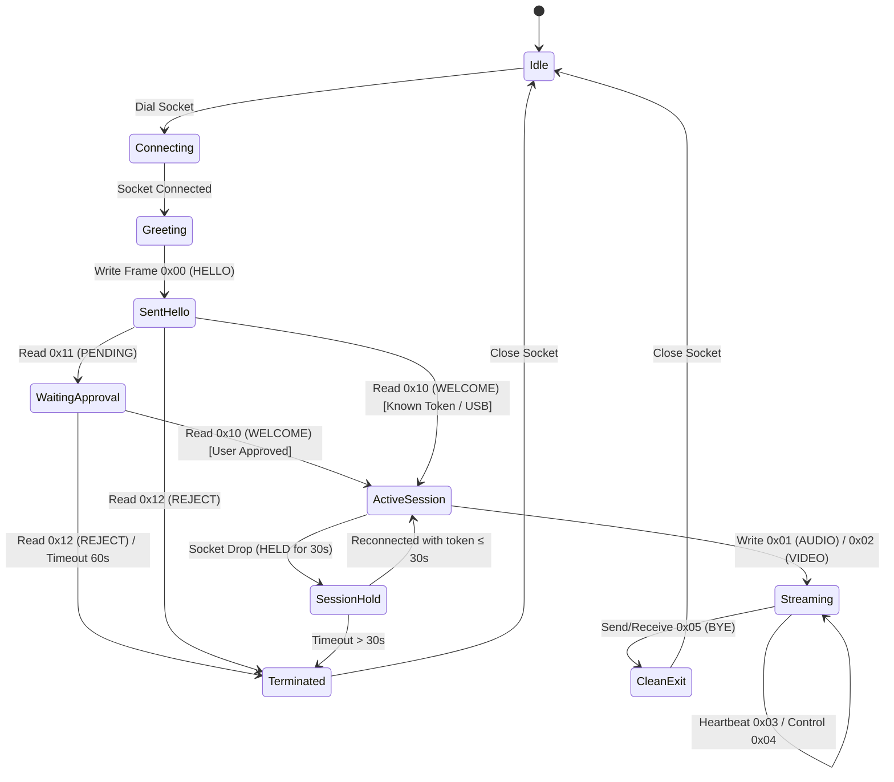

# Wire Protocol & Framing Specification

Owlmic uses a lean, deterministic binary wire protocol over reliable streams (TCP and Bluetooth RFCOMM). It provides low-overhead framing for high-frequency media delivery while multiplexing structured UTF-8 JSON payloads for control, synchronization, and authentication.

---

## 1. Binary Frame Structure

Every transmission begins with a fixed **5-byte frame header** followed by the declared payload bytes:

```text
 0                   1                   2                   3
 0 1 2 3 4 5 6 7 8 9 0 1 2 3 4 5 6 7 8 9 0 1 2 3 4 5 6 7 8 9 0 1
+-+-+-+-+-+-+-+-+-+-+-+-+-+-+-+-+-+-+-+-+-+-+-+-+-+-+-+-+-+-+-+-+
|   Type (u8)   |               Payload Length (u32 BE)          ...
+-+-+-+-+-+-+-+-+-+-+-+-+-+-+-+-+-+-+-+-+-+-+-+-+-+-+-+-+-+-+-+-+
...             |            Payload Data (0 .. 4 MiB)          ...
+-+-+-+-+-+-+-+-+-+-+-+-+-+-+-+-+-+-+-+-+-+-+-+-+-+-+-+-+-+-+-+-+
```

### 1.1 Header Fields
- **`Type` (`u8`)**: Single byte representing the frame opcode (see [Frame Types](#2-frame-types)).
- **`Payload Length` (`u32 BE`)**: Unsigned 32-bit big-endian integer declaring the exact byte count of the payload.
- **Maximum Length**: **4,194,304 bytes (4 MiB)** (`MAX_PAYLOAD_LEN`). Any frame declaring a length $> 4\text{ MiB}$ results in immediate socket termination to prevent heap exhaustion.

---

## 2. Frame Types (Opcodes)

| Opcode | Name | Direction | Encoding | Purpose |
| :---: | :--- | :---: | :--- | :--- |
| **`0x00`** | **`HELLO`** | Phone → PC | UTF-8 JSON | Initial connection greeting with device credentials |
| **`0x10`** | **`WELCOME`** | PC → Phone | UTF-8 JSON | Handshake acceptance; returns PC identity and token |
| **`0x11`** | **`PENDING`** | PC → Phone | UTF-8 JSON | Notice that PC is displaying an "Allow?" modal to the user |
| **`0x12`** | **`REJECT`** | PC → Phone | UTF-8 JSON | Handshake refusal (version, busy, untrusted) |
| **`0x01`** | **`AUDIO`** | Phone → PC | 14-byte Header + Media | 10 ms audio frames (raw PCM or Opus) |
| **`0x02`** | **`VIDEO`** | Phone → PC | 14-byte Header + Media | Compressed video frames (JPEG) |
| **`0x03`** | **`HEARTBEAT`**| Bidirectional | UTF-8 JSON | Liveness ping/pong emitted every 5,000 ms |
| **`0x04`** | **`CONTROL`** | Bidirectional | UTF-8 JSON | Bidirectional settings, remote mute, lens flipping |
| **`0x05`** | **`BYE`** | Bidirectional | UTF-8 JSON | Intentional teardown (`stop`, `switch`, `disconnect`) |

---

## 3. Media Header Specification (Opcode `0x01` & `0x02`)

For `AUDIO` and `VIDEO` frames, the first **14 bytes** of the payload consist of the binary `MediaHeader`:

```text
 0                   1                   2                   3
 0 1 2 3 4 5 6 7 8 9 0 1 2 3 4 5 6 7 8 9 0 1 2 3 4 5 6 7 8 9 0 1
+-+-+-+-+-+-+-+-+-+-+-+-+-+-+-+-+-+-+-+-+-+-+-+-+-+-+-+-+-+-+-+-+
|                     Sequence Number (u32 BE)                  |
+-+-+-+-+-+-+-+-+-+-+-+-+-+-+-+-+-+-+-+-+-+-+-+-+-+-+-+-+-+-+-+-+
|                                                               |
+                 Capture Timestamp (u64 BE, µs)                +
|                                                               |
+-+-+-+-+-+-+-+-+-+-+-+-+-+-+-+-+-+-+-+-+-+-+-+-+-+-+-+-+-+-+-+-+
|   Codec (u8)  | Reserved (u8) |        Media Payload ...      |
+-+-+-+-+-+-+-+-+-+-+-+-+-+-+-+-+-+-+-+-+-+-+-+-+-+-+-+-+-+-+-+-+
```

### 3.1 Field Breakdown
1. **`Sequence Number` (`u32 BE`, Bytes 0..3)**: Monotonically increasing 32-bit counter per stream. Tracks packet loss and arrival order.
2. **`Capture Timestamp` (`u64 BE`, Bytes 4..11)**: Hardware capture time in **microseconds (µs)** (from `SystemClock.elapsedRealtimeNanos() / 1000`). Used by the PC's `JitterBuffer` for arrival variance and jitter estimation.
3. **`Codec` (`u8`, Byte 12)**:
   - `0x01` (`CODEC_PCM`): Uncompressed 48 kHz mono 16-bit signed PCM (s16le).
   - `0x02` (`CODEC_OPUS`): Compressed Opus packet.
   - `0x10` (`CODEC_JPEG`): Compressed standard JPEG image.
4. **`Reserved` (`u8`, Byte 13)**: Reserved for future alignment flags; must be `0x00`.

---

## 4. Payload Schemas & JSON Structures

### 4.1 `HELLO` Frame (`0x00`)
```json
{
  "proto": 2,
  "device_id": "8f3b2a1c0d4e5f67",
  "device_name": "Pixel 8 Pro",
  "level": 1,
  "token": "4a7f9b2c...32_hex_chars...1e0d",
  "has_camera": true
}
```

### 4.2 `WELCOME` Frame (`0x10`)
```json
{
  "proto": 2,
  "pc_id": "a1b2c3d4e5f60718",
  "pc_name": "DESKTOP-OWLMIC",
  "token": "4a7f9b2c...32_hex_chars...1e0d",
  "session_token": "99e8d7c6b5a43210",
  "resumed": false,
  "caps": ["vcam", "opus", "rnnoise"],
  "heartbeat_ms": 5000
}
```

### 4.3 `PENDING` Frame (`0x11`)
```json
{
  "request_id": 42,
  "device_name": "Pixel 8 Pro"
}
```

### 4.4 `REJECT` Frame (`0x12`)
```json
{
  "reason": "untrusted"
}
```
*Standard Reasons:*
- `"version"`: Incompatible wire protocol version.
- `"busy"`: Another phone is currently actively streaming.
- `"untrusted"`: User clicked "Block" or timed out on the PC TOFU dialog.
- `"rejected"`: PC administrator policy disallows the connection.

### 4.5 `CONTROL` Frame (`0x04`)
Bidirectional state synchronization payload:
```json
{
  "mic": {
    "mute": false
  },
  "camera": {
    "on": true,
    "lens": "back",
    "resolution": "1080p",
    "fps": 30
  },
  "audio_dsp": {
    "ns_strength": 80,
    "auto_gain": true
  }
}
```

### 4.6 `HEARTBEAT` Frame (`0x03`)
```json
{
  "ts_us": 1727610000123456
}
```

### 4.7 `BYE` Frame (`0x05`)
```json
{
  "reason": "switch"
}
```
*Standard Reasons:*
- `"stop"`: User explicitly toggled mic and camera off.
- `"switch"`: Make-before-break upgrade cleanly closing the previous transport.
- `"disconnect"`: PC user clicked "Disconnect" in the companion flyout.
- `"suspend"`: Device entering system sleep.

---

## 5. Protocol State Machine


